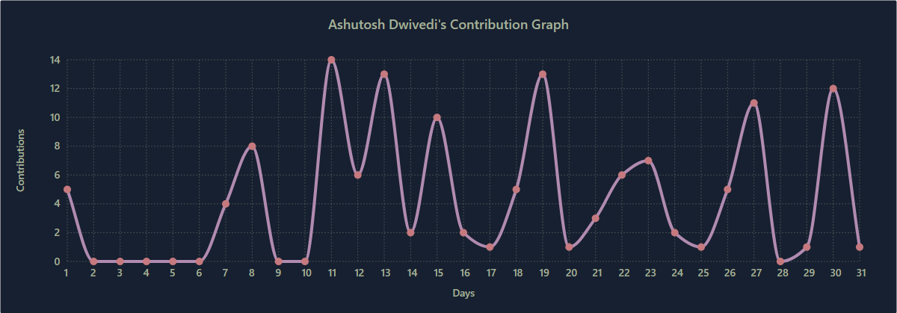
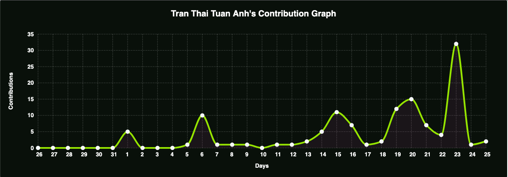
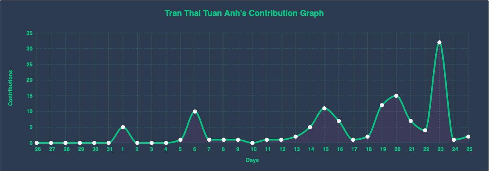
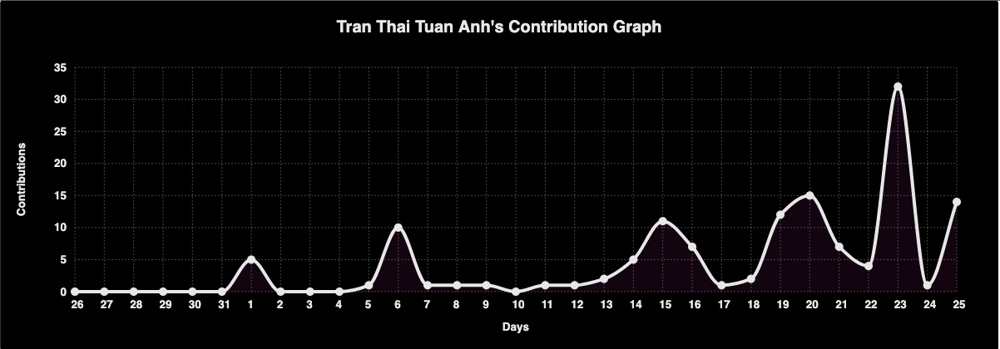
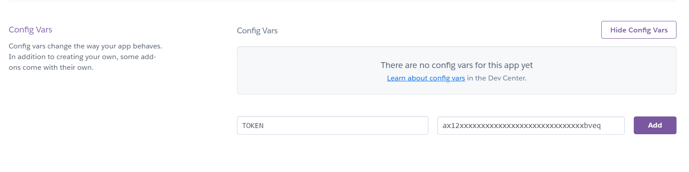
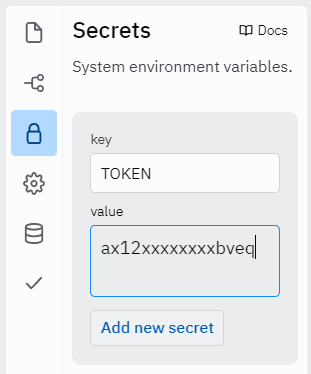

<p align="center">
    
</p>

<h1 align="center">Github Readme Activity Graph</h1>

<a href="https://jb.gg/OpenSourceSupport">
<p align="center">
    
</p>
</a>
<h3 align="center"><a href="https://jb.gg/OpenSourceSupport">Supported by JetBrains</a></h3>
A dynamically generated activity graph to show your GitHub activities of last 31 days.

## Table of contents

- [Table of contents](#table-of-contents)
- [How to Use](#how-to-use)
  - [Attention ⚠](#attention-)
- [Use themes](#use-themes)
- [Available Themes](#available-themes)
- [Customization](#customization)
  - [Common Options](#common-options)
- [Deploy on your own Heroku instance](#deploy-on-your-own-heroku-instance)
  - [Step-by-step instructions for deploying to Heroku **(from UI)**](#step-by-step-instructions-for-deploying-to-heroku-from-ui)
  - [Step-by-step instructions for deploying to Heroku **(from CLI)**](#step-by-step-instructions-for-deploying-to-heroku-from-cli)
- [Deploy on your own Replit instance](#deploy-on-your-own-replit-instance)
  - [Step-by-step instructions for deploying to Replit **(from UI)**](#step-by-step-instructions-for-deploying-to-replit-from-ui)
- [Contributing](#contributing)
- [Core Team 💻](#core-team-)
- [Contributors ✨](#contributors-)
- [Resources Used to build this project](#resources-used-to-build-this-project)
  - [Made with ❤ and TypeScript ](#made-with--and-typescript-)

## How to Use

Just paste the following URL in your profile readme and you are good to go.

**Pass your `username` in the URL**

```md
[](https://github.com/Soburjon19/github)
```

### [Attention ⚠](#Deploy-on-your-own-heroku-instance)

## Use themes

_`username=Soburjon19&theme=theme_name`_

```md
[](https://github.com/Soburjon19/github)
```

[Manual Customization](#customization) is also available

## Available Themes

|            Name            |                          Preview                            |
| :------------------------: | :--------------------------------------------------------:  |
| **Default (cotton candy)** |      |
|         **react**          |        |
|       **react-dark**       |   |
|         **github**         |       |
|         **xcode**          |        |
|         **rogue**          |        |
|         **merko**          |        |
|          **vue**           |          |
|       **tokyo-night**      |  |
|       **high-contrast**    ||

For more themes click [here](https://github.com/Soburjon19/github/blob/main/THEMES.md)

## Customization

Customize the appearance of your Activity Graph however you want with URL params.

#### Common Options

|   Arguments    |                  Description                  |       Type of Value        |
| :------------: | :-------------------------------------------: | :------------------------: |
|   `bg_color`   |            card's background color            |   hex code (without `#`)   |
|    `color`     |            graph card's text color            |   hex code (without `#`)   |
| `title_color`  |            graph card's title color           |   hex code (without `#`)   |
|     `line`     |              graph's line color               |   hex code (without `#`)   |
|    `point`     |         color of points on line graph         |   hex code (without `#`)   |
|  `area_color`  |       color of the area under the graph       |   hex code (without `#`)   |
|     `area`     |          shows area under the graph           | boolean (default: `false`) |
| `hide_border`  |   makes the border of the graph transparent   | boolean (default: `false`) |
|  `hide_title`  |       sets the title to an empty string       | boolean (default: `false`) |
| `custom_title` |          set the title to any string          |           string           |
|    `theme`     | name of [available themes](#available-themes) |           string           |
|   `radius`     |            border radius of graph             |  number (0-16 inclusive)   |

⚠ **For `custom_title` please make sure that you are using %20 for spaces**

Example:

**`custom_title=This%20is%20a%20title`**

```md
[](https://github.com/Soburjon19/github)
```

**Example:**

```md
[](https://github.com/ashutosh00710/github-readme-activity-graph)
```

## Deploy on your own Heroku instance

The GitHub API only allows limited requests per hour, my activity-graph.herokuapp.com/graph could possibly hit the rate limiter. If you host it on your own Heroku server, then you don't have to worry about anything.

You may use the server used by this project at <https://activity-graph.herokuapp.com> and pass in your username to access your graph.
E.g. `https://activity-graph.herokuapp.com/graph?username=<your_username>`

However, if there are a large number of requests or if the heroku account being used for the project runs out of dyno hours your graph will not load.

### Step-by-step instructions for deploying to Heroku (from UI)

1. Sign in to Heroku or create a new account at <https://heroku.com>
2. Click the Deploy button below

<p align="center">
    <a href="https://heroku.com/deploy?template=https://github.com/Ashutosh00710/github-readme-activity-graph/main">
        
    </a>
</p>

3. On the page that comes up, click "**Deploy App**" at the end of the form
4. Once the app is deployed, click "**Manage App**" to go to the dashboard
5. Visit the "**Settings**" tab and click "**Reveal Config Vars**"
6. Visit [this link](https://github.com/settings/tokens/new?description=GitHub%20Readme%20Activity%20Graph) to create a new Personal Access Token
7. Scroll to the bottom and click "**Generate token**"
8. Add the token as a Config Var with the key `TOKEN`



9. Scroll down to the Domains section to find the URL you will use in place of `activity-graph.herokuapp.com`

### Step-by-step instructions for deploying to Heroku (from CLI)

1. Make a [Heroku](https://signup.heroku.com/) account.
2. Install the Heroku CLI
   - Mac: `brew install heroku/brew/heroku`
   - Ubuntu: `sudo snap install heroku --classic`
   - Windows: [Find the Windows installer here](https://devcenter.heroku.com/articles/heroku-cli#download-and-install)
3. Clone the repository: `git clone https://github.com/Ashutosh00710/github-readme-activity-graph.git`
4. Navigate in to the directory: `cd github-readme-activity-graph`
5. Login to Heroku: `heroku login`
6. Create Heroku app: `heroku create` and copy the URL you are given as output.
7. Deploy app to heroku: `git push heroku main`
8. [Generate personal access token](https://github.com/settings/tokens). Copy your token.
9. Set token as heroku config var: `heroku config:set TOKEN=<your token goes here>`

Now just add the following to your profile readme and you're good to go.

```md

```

## Deploy on your own Replit instance

### Step-by-step instructions for deploying to Replit (from UI)

1. Sign in to Replit or create a new account at https://replit.com
2. Click the Deploy button below

<p align="center">
<a href="https://repl.it/github/Soburjon19/github">
  
</a></p>

3. On the page that comes up, choose language as `Node.js` and then click `Import from GitHub` Button


4. Visit the "**Settings**" tab and click "**Reveal Config Vars**"
5. Visit [this link](https://github.com/settings/tokens/new?description=GitHub%20Readme%20Activity%20Graph) to create a new Personal Access Token
6. Scroll to the bottom and click "**Generate token**"
4. Wait clone done and add `Secrets` with your `Github token`



5. Click the green `RUN` button on top, the console will run and at last the url will shows on the right
6. Now just add the following to your profile readme and you're good to go

```

```

## Contributing

Please read through our [contributing guidelines](https://github.com/Soburjon19/github/blob/master/CONTRIBUTING.md). Directions are included for opening issues, coding standards, and notes on development.
<!-- 
## Core Team 💻

<table>
    <tr>
        <td align="center">
        <a href="http://github.com/Ashutosh00710">
            
            <br />
            <sub><b>Ashutosh Dwivedi</b></sub>
        </a>
        <br />
        <a href="#projectManagement" title="Project Management">📆</a>
        <a href="https://github.com/Ashutosh00710/github-readme-activity-graph/commits?author=ashutosh00710" title="Code">💻</a>
        <a href="#documentation" title="Documentation">📖</a>
        <a href="#ideas" title="Ideas & Planning">🤔</a>
        <a href="#testing" title="Testing">⚠</a>
    </td>
    <td align="center">
        <a href="http://github.com/kshitij978">
            
            <br />
            <sub><b>Kshitij Srivastava</b></sub>
        </a>
        <br />
        <a href="#projectManagement" title="Project Management">📆</a>
        <a href="https://github.com/Ashutosh00710/github-readme-activity-graph/commits?author=kshitij978" title="Code">💻</a>
        <a href="#documentation" title="Documentation">📖</a>
        <a href="#design" title="Design">🎨</a>
    </td>
    </tr>
</table>
 -->

<!-- 

## Resources Used to build this project

|      Purpose       |  Library Name   |                   Link                    |
| :----------------: | :-------------: | :---------------------------------------: |
| Graph Construction | **CHARTIST.JS** | <https://github.com/Soburjon19/> |

</br>
<hr/>

## Star History

[](https://star-history.com/#Ashutosh00710/github-readme-activity-graph&Timeline)

-->

### Made with ❤ and TypeScript 
